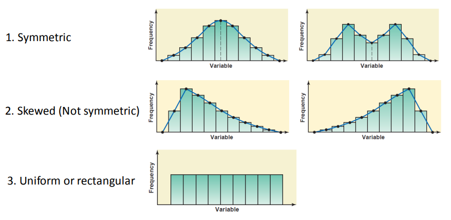
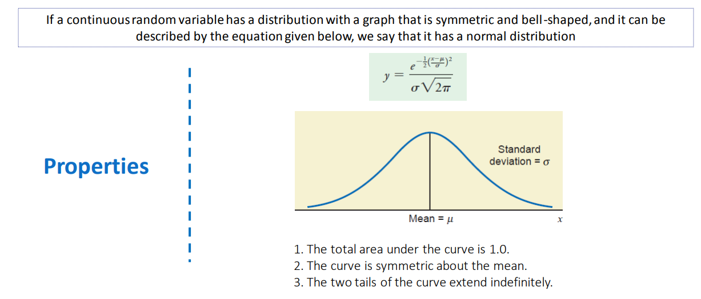

# Basics of Statistics
- Types of data
    - **Qualitative (or) Cateogorical data**
    - A variable that cannot assume a numerical value but can be classified into two (or) more nonnumeric categories is called a qualitative (or) cateogorical variable. The data collected on such a variable are called qualitative data.
    - Types of qualitative data:
        - Nominal
            - Nominal variables hold the values that cannot be ordered
            - Example: Nationality, Gender
            - There is no concept of ranking here!
                - As male and female are only gender but there is no ranking between them.
        - Ordinal
            - The values are ordered (or) ranked.
            - Examples:
                - Satisfaction score (Not satisfied, Satisfied, Delighted)
                - Spiciness of food (Less spicy, mild, hot)
            - It is not possible to quantify ordinal variable values, but they can be ranked!
    - **Quantitative data**
    - Quantitative variables are those variables that can be measured numerically. The data collected on a quantitative variable are called quantitative data.
    - Types of quantitative data:
        - Discrete
            - Discrete variables are variables whos values are countable.
            - Example:
                - Number of heads in 10 coin tosses.
        - Continuous
            - A variable that can take any numerical value over a certain interval (or) intervals is called a continuous variable.
            - Example:
                - Rainfall measurements.
                - Weight of a lady.
            - In realiy all systems can handle only discrete variables. (precision comes into picture in real systems!) (Pseudo continous stuff in reality)
- Types of statistics:
    - Descriptive statistics
        - Descriptive statistics consists of mthods for organizing, displaying, and describing data by using tables, graphs, and summary measures.
        - Commonly used tools for describing data:
            - Measures of central tendency
                - Mean / average
                    - Note (population mean vs sample mean)
                        - population mean is actual average all the data
                        - sample mean is the average of some samples from the data.
                - Median
                - Mode
                    - Bimodal
                    - multimodal
                    - no mode
                - Mid-range
                    - (max + min)/2
            - Measures of dispersion
                - Range
                - Standard deviation
                - variance
            - Frequency distributions
            - Histograms
    - Inferential statistics
        - Inferential statistics consists of methods that use sample results to help make predictions.
        - Inferential statistics help in identifying patterns and trends from sample of data, which will guide us in making predictions!!
        - Some common inferential techinques are
            - Linear regression
            - Logistic regression
            - Linear discriminant analysis(LDA) & KNN
            - Descision trees
            - many more..
### Frequency distribution (A type of descriptive anlysis)
- A frequency distribution for qualitative data lists all categories and the number of elements that belong to each of the categories.
    - Example:
        - Raw data of students can be scanned and a following frequency distribution can be constructed
            | Branch            | Strength      |
            |:------------------|:--------------|
            | CSE               |   120         |
            | ME                |    90         |
            | EE                |   100         |
            | Math              |    80         |
            Relative frequency of a category = (Freq of that category) / (Sum of all frequencies)
    - We can represent frequency distribution also as bar graph
        - A BAR graph is a graph made of bars whose height represent the frequencies of respective categories.
- A frequency distribution for quantitative data lists all the classes and the number of values that belong to each class.
    - Data represented in the form of a frequency distribution are called grouped data.
    - Example:
        - Suppose we have list of students and their science marks. This is ungrouped data. We can construct many grouped datas from this ungoruped data and one such grouped data is the following:
        -   | Science marks   | Number of students    |
            |:----------------|:----------------------|
            |   0-35          |     10                |
            |  36-55          |     45                |
            |  56-70          |     20                |
            |  71-85          |     4                 |
            |  86-100         |     2                 |
    - We use histograms, which consists of bars of equal width (indicating same class width) drawn adjacent to each other.
        - Common histogram shapes
            1) Symmetric
            2) Skewed
            3) Uniform (or) rectangualar
        - 
        - Normal distribution:
            - 

# Introduction to ML

- **Predictive models**
    - Predictive models are designed to forecast future outcomes based on historical data. They identify patterns and relationships within the data to make informed guesses about future events.
- **Prescriptive models**
    - Prescriptive models go a step further than predictive models by not only forecasting future outcomes but also recommending actions to achieve desired results. They provide guidance on the best course of action to take.

### Types of learning
- Supervised learning
    - Classification (Y is discrete)
    - Regression (Y is continous)
- Unsupervised learning
    - Clustering