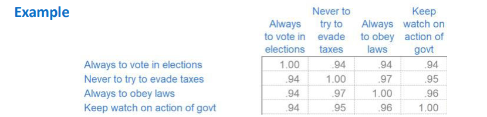

# Data preprocessing
Data preprocessing is one of key steps to begin before building ML models.

# Table of contents
| Name | description |
|:-----|:------------|
| [step1](step1) | Business knowledge, EDD, uni-variate analysis |
| [step2](step2) | Missing value imputation, Outlier treatment, seasonability, variable transformation, Non-useable variables, correlation, dummary variable creations |

## Notes of [step1](step1)
- Univariate analysis
    - Univariate analysis is a type of data analysis that focuses on analyzing a single variable at a time. It is the simplest form of data analysis and is primarily concerned with describing and summarizing the main characteristics of a dataset through statistical measures and visualizations.
- Data dictionary
- EDD (extended data dictionary)

## Notes of [step2](step2)
- Outlier treatment
- Outliers are generally replaced by other values.
- When data has outliers
    - then data tend to have larger difference between mean and median.
    - then data hs abnormal high standard deviation which will result that standard deviation is not right metric for dispersion. (that is why outliers should be treted carefully)
- Mssing value imputation
- **seasonality in data**
    - Recurring trends in data.
    - It is advisible to remove seasonality in data.
        - To do that we need multiplication factor.
----------------------------------------------------------------------------
- **Bivariate analysis**
- **Correlation**
    - If x increses then y increses, and x decreases then y decreases 
        - implies that x and y are positively correlated
    - If x increses then y decreases and x decreases then y increses
        - implies that x and y are negatively correlated.
    - If x and y are randomly changing 
        - then correlation coeff will be near to zero.
- If a k's value is highly dependent on another variable x, then it is better to stop considering k as independent variable. We may have to remove on of them (x (or) k). Because :
    - __Multicollinearity__ refers to a situation in multiple regression models where two or more predictor variables are highly correlated, meaning they contain similar information about the variance in the dependent variable. This correlation can create issues in understanding the effect of each predictor on the outcome variable and can complicate the estimation of model coefficients.
- a __correlation coefficient__ (Pearson correlation) threshold is used to identify and possibly drop one of the variables in cases of high multicollinearity. The commonly accepted threshold for considering two variables to be highly correlated, and thus a candidate for dropping, is:
    - |r| > 0.8: Variables with an absolute correlation coefficient greater than 0.8 are usually considered highly correlated. (so generally one of them is dropped)
- Full negative correlation
    - Consider two variables is_male and is_female. If is_male is True then is_female is False. and vice versa. is_male and is_female variables are said to be fully negatively correlated.
- The quantification of correlation is correlation coeffecient.
- Correlation matrix is a matrix representing pair wise variables correlation coefficient.
    - 
    - We can identify which two variables are highly correlated. Which will indicate us the problem of __Multicollinearity__. It is important to identify highly correlated independent variables and remove one of the two.
    - Which one should we drop?
        - Drop which makes less business sense.
        - If both of the variables make same businees sense then keep the variable which has coorelation with depedent variable(output).
        - You may drop the variable for which getting data is hard as well.
- Correlation does not imply __causation__.
----------------------------------------------------------------------------
- **Variable transformation**
    - Tansformaing vraible is not a mandatory thing. 
    - We transform a varibale in the hope that the ML model will fit better.
    - Run the model without doing transformations and with transformations and compare which model performs better.
    - Example:
        - Using mean/median
            - In House_Price.csv dataset, we can see dist1, dist2, dist3, dist4 which indiacate distance from employment hubs. It is better to use mean of all theses 4 distances, because that will convey the same information as done by all 4 distances. (variable reduction and variable transformation)
        - Creating ratio variables if it makes sense
            - If we assume quality of education implacts house price, then it is better to choose number of teachers per student and not total number of teachers.
        - Transform variable by taking log, exponenetial, roots etc..
            - log behaves radically in 0 to 1. So better to avoid that by adding some constants to ignore interval between 0 and 1.
----------------------------------------------------------------------------
- **Non usable variables**
    - better to remove them.
----------------------------------------------------------------------------
- **Dummy variable creation**
    - Regression analysis cannot handle data in labels, it can only handle data with numerical values.
    - So we have to smartly assign values to labels of varaible. 
        - Like yes (or) no
        - Like river (or) lake (or) both (or) none
----------------------------------------------------------------------------