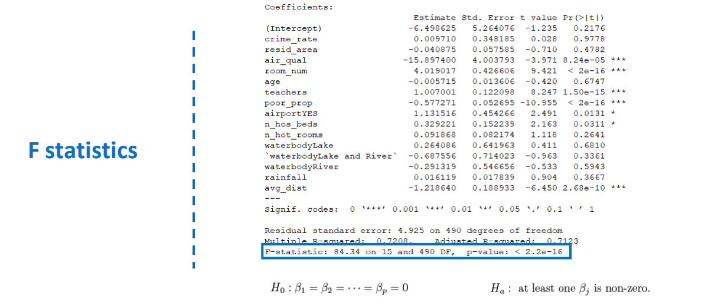
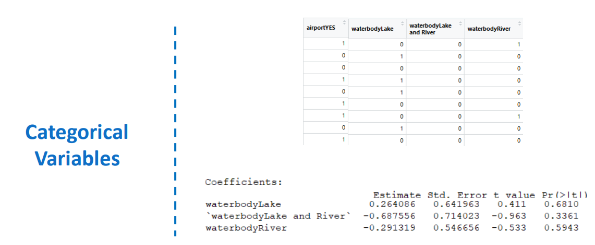
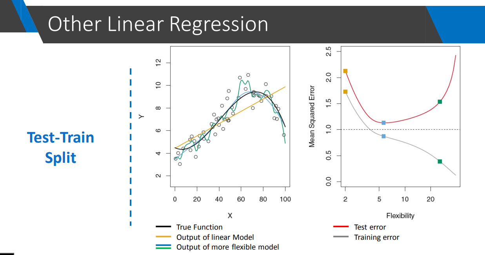
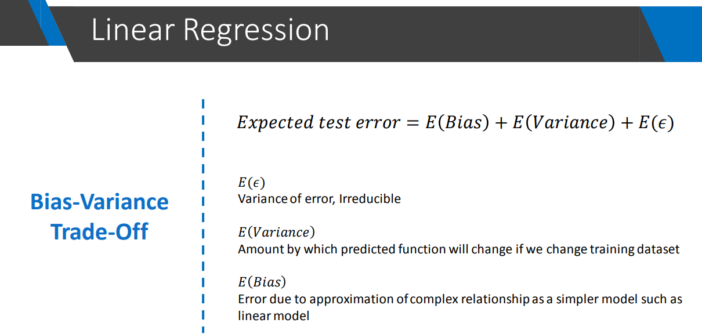
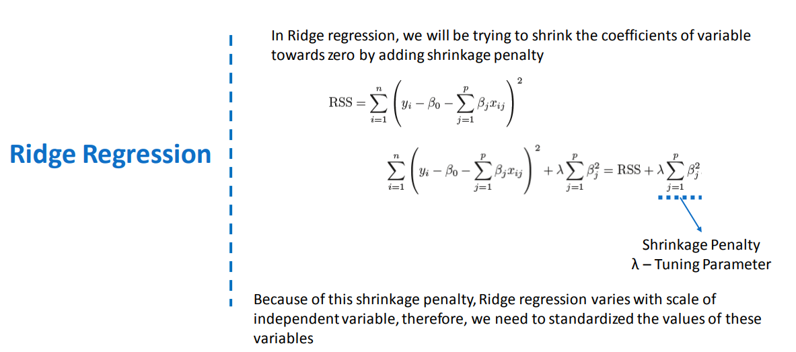

# Stage5 : Linear regression

- Simple linear regression: predicting Y based on a single predictor variable X.
- Standard Error SE($) is how far the estimated coeffecient is from population coefficient.
-  **Multiple linear regression**
    - more than one predictor variable
    - just an extension of simple linear regression
    - Multiple R-squared: 0.72
        - that means 72 percent of the variance in the values of price is explained by the model
    - Adjusted R-squared
        - taking into account the number of variables.
- **The F-statistic**
    - 
    - If we see individual p-values and make conclusion that at least one of the coeff is not zero, then we are doing mistake!! 
        - We have to see F-static, which takes into account all variables.
            - If the p-value corresponding to F-statis is small, then we can assure that there is a signifact relationship between predictor values and output value (that is at least one coeff of all variables is not zero)
- **Interpreting results of categorical variables**
    - 
        - As the p-values in above picture are low
        - that means statistically there is less confidence that relationship given by estimated holds (or) not
- **Test-train split**
    - We are going to split the data into
        1) training datae
        2) test data
    - Less training does not imply less test error
        - This is known as generalization-memorization trade off.
        - 
    - There are many ways to perform train-test split
        1) _Validation set approach_
            - limitations
                - A part of data is not used for training and only used for testing.
                - Test error can vary highly, because it depends on which data goes to training and which goes to testing.
        2) _Leave one out cross validation_
            Leave-One-Out Cross-Validation (LOOCV) is a technique used to evaluate the performance of a machine learning model. Here’s how it works:

            1. **Dataset Preparation**: Suppose you have a dataset with \( n \) samples.

            2. **Training and Validation**: For each iteration of LOOCV:
            - Take one sample from the dataset as the validation set.
            - Train the model on the remaining \( n-1 \) samples.

            3. **Evaluation**: Evaluate the model on the single sample that was left out (the validation set) and record the performance metric (such as accuracy, error rate, etc.).

            4. **Iteration**: Repeat the process \( n \) times, each time leaving out a different sample as the validation set.

            5. **Aggregate Results**: Calculate the average performance metric across all \( n \) iterations to get an overall estimate of the model’s performance.

            ### Advantages:
            - **Utilizes all data**: Ensures that every sample is used both for training and validation, maximizing the use of available data.
            - **Low bias**: Provides an unbiased estimate of model performance because each sample is used as a validation set exactly once.

            ### Disadvantages:
            - **Computational Cost**: Can be computationally expensive, especially for large datasets, since it requires fitting the model \( n \) times.
            - **Variance in Results**: The results can have higher variance because the model is evaluated on a single data point in each iteration, which might not be representative of the entire dataset.

            LOOCV is particularly useful when you have a small dataset or when you want to squeeze out maximum information from your data. However, due to its computational intensity, it may not be practical for very large datasets where other cross-validation methods like \( k \)-fold cross-validation are more commonly used.
        3) _K-Fold validation_
            - Leave one out cross validation is a special case of K-fold validation
- **Bias-variance trade off**
    - 
        - E(ε) is due to 
            - Given sample obervations may not exactly follow true function
            - Cannot do much on it
    - More flexible method (overfitting) has high variance
    - More flexible leads to less bias error.
    - Increasing flexibility
        - decreases bias error
        - increases variance error
- **R square value**
    - R^2 = 0 The model does not explain any of the variance in the target variable.
    - R^2 = 1 The model explains all the variance in the target variable.
    - 0 < R^2 < 1  The model explains a certain proportion of the variance, with higher values indicating a better fit.
- **Variable selection**
    - Removing not important independent variables.
- **Subset selection method**
- **Shrinkage (or) regulrization methods**
    1) Ridge regression
        - 
        - Note that there is no intercept in shrinkage penality, because the intention is only to shrink coeff and not intercept.
        - Before running rdge regression we need to standardize all the varibales.
            - Example height in centi meters and meters are on different scales, they need to stnadardized.
        - shrinkage penality makes model less flexible
        - Coefficient Shrinkage: Ridge does not set coefficients to zero but shrinks them towards zero. This means all predictors remain in the model but with reduced impact.
        - Use Cases: Ridge is useful when you believe that most predictors are relevant, but you want to prevent overfitting by shrinking their coefficients.
    2) The Lasso
        - Feature Selection: Lasso can shrink some coefficients to exactly zero, effectively performing feature selection. This means Lasso can produce sparse models, which are easier to interpret.
        - Use Cases: Lasso is useful when you suspect that only a few predictors are actually relevant, and you want to perform variable selection.

## Keywords 
- Simple regression.
- Least squared error.
- Residual sum of squares (RSS).
- Sample regression line.
- Population regression line.
- Residual standard error. (RSE)
- Hypothesis testing.
