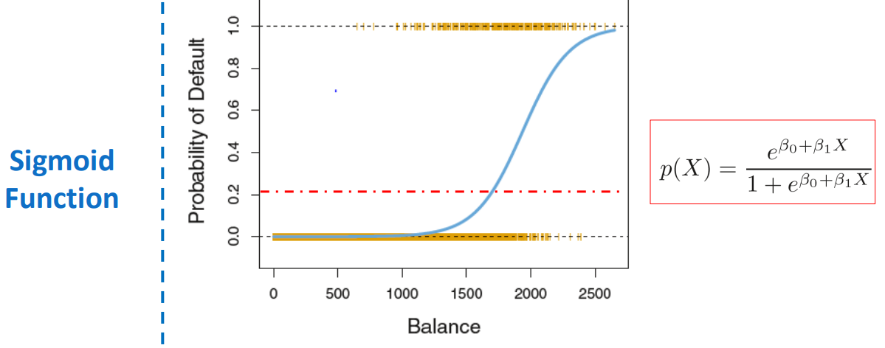

# stage6 : Classification models
- In this section I learned classifaction models
- Dependent variable is categorical : then it is classification problem
- Three classification models
    1) Logistic regression
    2) Linear Discriminant Analysis (LDA)
    3) K-Nearest Neighbours (KNN)
- We will use customer preprocessed data 
    - where dependent variable is Sold, which is 1 when the house got sold within 3 months of getting listed, else it equals 0.
    - Price is independent vriable 
        - here the price is the amount at which the owner is willing to sell the property.
    - this data is pre-processed 
- Linear regression cannot be used for more than two categories in classification problem.
    - Linear regression is very sensitive to outlying points.
    - Though Linear regressions can solve two cateogory problem but it is not preferred.

## Logoistic regression
- Sigmoid function (or) logistic function
    - 
- We use Maximum likelihood method in logistic regression to get the coeffecients and intercept in likelihood function.
- Logistic regression can be extended to solve the problem statements where dependent variable takes more than 2 values. (that is multi-class problems). But in practise Logistic regression is not used in such a case. LDA is popularly used for non-binary classification problems.
- **Confusion matrix**
    - This matrix is very useful for anlyzing our model accuracy.
    - For binary classification problem
        - true positive
        - true negative
        - false positive
        - false negative
    - The cost of false positive and false negative is not same always.
        - Example
            - Let us consider face recognition for your phone.
            - It is okay some times if the face recognition system does not recognize us.
            - But it is not okay if some random person face got recognized even 1 time in 100 times tried.
    

