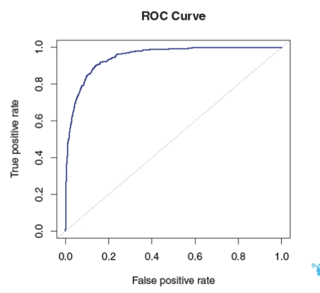

# stage6 : Classification models
- In this section I learned classifaction models
- Dependent variable is categorical : then it is classification problem
- Three classification models
    1) Logistic regression
    2) Linear Discriminant Analysis (LDA)
    3) K-Nearest Neighbours (KNN)
- We will use customer preprocessed data 
    - where dependent variable is Sold, which is 1 when the house got sold within 3 months of getting listed, else it equals 0.
    - Price is independent vriable 
        - here the price is the amount at which the owner is willing to sell the property.
    - this data is pre-processed 
- Linear regression cannot be used for more than two categories in classification problem.
    - Linear regression is very sensitive to outlying points.
    - Though Linear regressions can solve two cateogory problem but it is not preferred.

## Logoistic regression
- Sigmoid function (or) logistic function
    - 
- We use Maximum likelihood method in logistic regression to get the coeffecients and intercept in likelihood function.
- Logistic regression can be extended to solve the problem statements where dependent variable takes more than 2 values. (that is multi-class problems). But in practise Logistic regression is not used in such a case. LDA is popularly used for non-binary classification problems.
- **Confusion matrix**
    - This matrix is very useful for anlyzing our model accuracy.
    - For binary classification problem
        - true positive
        - true negative
        - false positive
        - false negative
    - The cost of false positive and false negative is not same always.
        - Example
            - Let us consider face recognition for your phone.
            - It is okay some times if the face recognition system does not recognize us.
            - But it is not okay if some random person face got recognized even 1 time in 100 times tried.
- **ROC** curve
    - The ROC (Receiver Operating Characteristic) curve is a graphical representation used to evaluate the performance of a binary classification model in machine learning. It plots the True Positive Rate (TPR) against the False Positive Rate (FPR) at various threshold settings.
    - 
        - The stright line in the above curve is ROC curve of random classifier.
        - For a good ML model aread under ROC curve should be equal to area of the sqare shown in the above picture. (That is the bending should be close to 1)
    - The AUC (Area Under the Curve) score is a metric used to evaluate the performance of a binary classification model. It represents the area under the ROC (Receiver Operating Characteristic) curve, providing a single scalar value that summarizes the model's ability to discriminate between the positive and negative classes.
        - Calculation:
            - To compute the AUC score
                - Plot the ROC Curve: Calculate the true positive rate (TPR) and false positive rate (FPR) for various threshold values.
                - Integrate the Area: The AUC is the integral of the ROC curve from FPR = 0 to FPR = 1. This can be approximated using various numerical methods if not done analytically.]
        - Range: The AUC score ranges from 0 to 1.
            - AUC = 1: Perfect classifier. The model perfectly distinguishes between positive and negative classes.
            - 0.5 < AUC < 1: Good classifier. The closer the AUC is to 1, the better the model is at distinguishing between positive and negative classes.
            - AUC = 0.5: No discrimination ability. The model performs no better than random guessing.
            - AUC < 0.5: Inverse classifier. The model's predictions are worse than random guessing, which suggests that the model might be mislabeling classes.

## LDA (Linear Discriminant Analysis)
- LDA, or Linear Discriminant Analysis, is a statistical method used in machine learning and pattern recognition for classification and dimensionality reduction. It aims to find a linear combination of features that characterizes or separates two or more classes of objects or events. 
- Key Concepts of LDA
    - Assumptions:
        - The classes are normally distributed.
        - The different classes have identical covariance matrices.

## KNN (K-Nearest Neighbours classifier)
- KNN is non-parametric method.
    - that is no function form assumed and so need to find parameters to find the assumed function
- K is often called Hiper parameter of KNN classifier
    - Value of K decides many things!
- It is madatory to scale data and standardize all the variables
- 