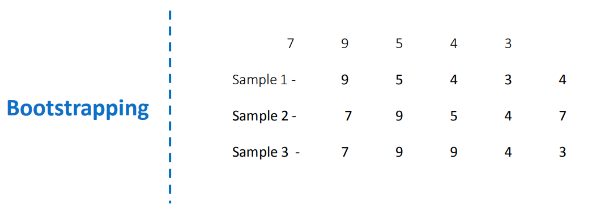

# stage7: Decision trees

## notes
- Simple decision tree is easy to interpret.
- Decision tress:
    1) Regression trees
    2) Classification trees

### Regression tree
- We make build nodes in regression tree so that RSS (Residual Sum Of Squares) is minimized.
- Top down greedy approach : Recursive binary splitting
- If the tree has a lot of decision nodes then 
    1) it is difficult to interpret the model
    2) the model may overfit the data, which leads to high test error
- Tree pruining
    - Weakest link pruning (or) cost complexity pruning
- RSS is used to decide the split.
- Data used in [DecisionTreeRegressor.ipynb](DecisionTreeRegressor.ipynb)
    - [Movie_regression](data/Movie_regression.csv)
        - Collection is the dependent variable.
        - The data is not pre-processed.

### Classification tree
- In regression tree we use mean to predict outcome, but in classification we use mode.
- Here also we use recursive binary splitting.
- In classification we can use following to decide the split (at a decision node):
    1) Classification error rate
    2) Gini index
        - small value of Gini index indicates high node purity.
    3) Cross Entropy 
        - small value of cross entropy indicates high node purity.
- Data used in [DecisionTreeClassifier.ipynb](DecisionTreeClassifier.ipynb)
    - [Movie_classification](data/Movie_classification.csv)
        - Start_Tech_Oscar is the dependent variable.

### Ensemble methods
- Ensemble means taking a group of things instead of individual things.
- Three Ensemble methods:
    1) Bagging
        - if the decison trees created have a dominated strong decison tree, then this would highly influence the final output largely everytime.
        - all the models created may be similar and taking mean (or) mode is not much useful. Then we go for random forests.
    2) Random forests
    3) Boosting
        i) gradient boosting
        ii) Ada boosting
        iii) XG booststing
- Normal decision tress has high variance
    - that means a decision tree trained on one training set is largely different compared to decision tree trained on another training set. (Assuming the training sets are not biased)
    - In the below picture we can see the decision trees are largely different which are trained on different training sets:
        - 
- We use the method of bootstrapping to generate more samples
    - We select 5 numbers randomly from {7, 9, 5, 4, 3} and create samples (as seen in below picture)
        - 
