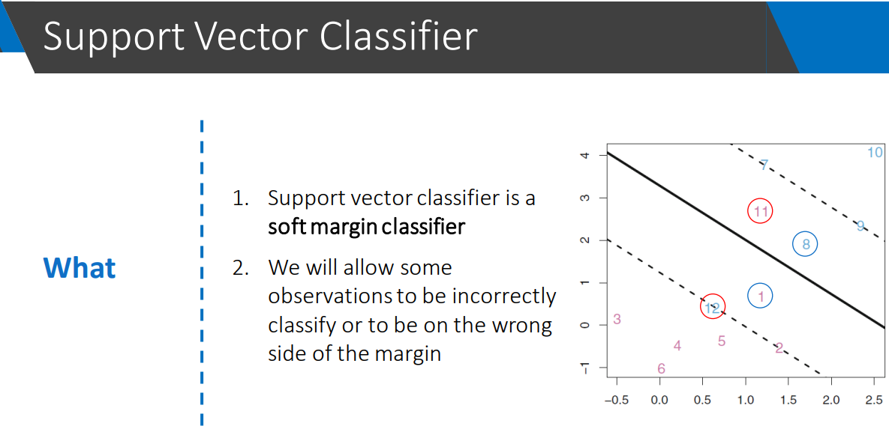

# Stage 8 : Support Vector Machines (SVM)

- SVM is out of the box

## notes

- flow of learning SVM
    1) Maximal margin classifier
    2) Support Vector Classifiers
    3) Support Vector Machines 
        - uses kernels 
- **Hyperplane**
    - 
- **Margin**
- **Support vectors**
- **Maximal margin classifier**
    - Classifier with maximum margin is maximal margin classifier
    - Limitations of Maximal margin classifier
        1) The data may not be perfectly linearly seperable
        2) Maximum margin classifier is more sensitive to support vectors (this is a problem when we have some noise '(or) outliers in data) (may prone to overfitting)
- **Support vector classifier**
    - is a _soft margin classifier_
    - 
        - In the above picture points 1 and 8 are inside the boundary(dashed lines - to categorize into two classes) but are rightly classified
        - In the above picture points 11 and 12 are on the wrong side of the hyperplane it self.
- **Kernel trick** 
- **Support vector machines**